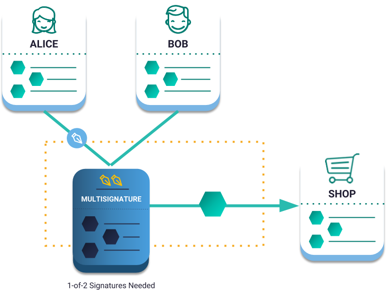
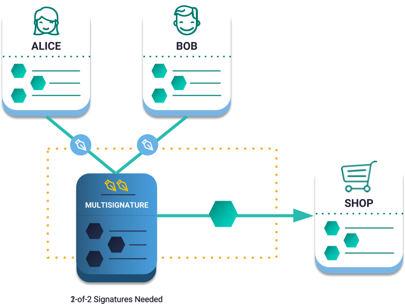

:orphan:

.. post:: 20 Aug, 2018
    :category: Aggregate Transaction, Multisig Account
    :excerpt: 1
    :nocomments:

##############################
Sending a multisig transaction
##############################

Send a transaction involving a :doc:`multisig <../../concepts/multisig-account>` and learn how an :ref:`aggregate bonded transaction <aggregate-transaction>` works.

**********
Background
**********

    Sending an aggregate complete transaction

Alice and Bob live together and have separate accounts. They also have a shared account so that if Bob is out shopping, he can buy groceries for both himself and Alice.

This shared account is in NEM translated as 1-of-2 multisig, meaning that one cosignatory needs to cosign the transaction to be included in a block.

Remember that a multisig account has cosignatories accounts, and it cannot start transactions itself. Only the cosignatories can initiate transactions.

*************
Prerequisites
*************

- Finish :doc:`sending a transfer transaction guide <sending-a-transfer-transaction>`
- Finish :doc:`converting an account to multisig guide <../account/converting-an-account-to-multisig>`
- NEM2-SDK
- A text editor or IDE
- An multisig account with XEM
- An cosignatory account with XEM

************************
Let’s get into some code
************************

Bob has finished filling his basket, and he is ready to pay. The cashier's screen indicates that the cost of the purchase adds up to 10 XEM.

1. Bob needs to know which is the public key of the multisig account that he shares with Alice, and his private key to start announcing the transaction.

.. example-code::

    .. literalinclude:: ../../resources/examples/typescript/transaction/SendingAMultisigTransactionAggregateComplete.ts
        :caption: |sending-a-multisig-transaction-aggregate-complete-ts|
        :language: typescript
        :lines: 33-41

    .. literalinclude:: ../../resources/examples/java/src/test/java/nem2/guides/examples/transaction/SendingAMultisigTransactionAggregateComplete.java
        :caption: |sending-a-multisig-transaction-aggregate-complete-java|
        :language: java
        :lines: 43-55

    .. literalinclude:: ../../resources/examples/javascript/transaction/SendingAMultisigTransactionAggregateComplete.js
        :caption: |sending-a-multisig-transaction-aggregate-complete-js|
        :language: javascript
        :lines: 33-41

2. As he wants to pay the groceries with the multisig account, he defines a :ref:`transfer transaction <transfer-transaction>`.

* Recipient: Grocery's address
* Message: Grocery payment
* Mosaics: [10 XEM]

.. example-code::

    .. literalinclude:: ../../resources/examples/typescript/transaction/SendingAMultisigTransactionAggregateComplete.ts
        :caption: |sending-a-multisig-transaction-aggregate-complete-ts|
        :language: typescript
        :lines:  44-49

    .. literalinclude:: ../../resources/examples/java/src/test/java/nem2/guides/examples/transaction/SendingAMultisigTransactionAggregateComplete.java
        :caption: |sending-a-multisig-transaction-aggregate-complete-java|
        :language: java
        :lines:  56-63

    .. literalinclude:: ../../resources/examples/javascript/transaction/SendingAMultisigTransactionAggregateComplete.js
        :caption: |sending-a-multisig-transaction-aggregate-complete-js|
        :language: javascript
        :lines:  44-49

3. Wrap the transfer transaction under an :ref:`aggregate transaction <aggregate-transaction>`, attaching multisig public key as the signer.

An aggregate transaction is **complete** if before announcing it to the network, all required cosigners have signed it. If valid, it will be included in a block.

Remember that we are using a 1-of-2 multisig account? As Bob has one private key to sign the transaction, consider an *aggregate complete transaction*.

.. example-code::

    .. literalinclude:: ../../resources/examples/typescript/transaction/SendingAMultisigTransactionAggregateComplete.ts
        :caption: |sending-a-multisig-transaction-aggregate-complete-ts|
        :language: typescript
        :lines:  52-56

    .. literalinclude:: ../../resources/examples/java/src/test/java/nem2/guides/examples/transaction/SendingAMultisigTransactionAggregateComplete.java
        :caption: |sending-a-multisig-transaction-aggregate-complete-java|
        :language: java
        :lines:  64-71

    .. literalinclude:: ../../resources/examples/javascript/transaction/SendingAMultisigTransactionAggregateComplete.js
        :caption: |sending-a-multisig-transaction-aggregate-complete-js|
        :language: javascript
        :lines:  52-56

4. Sign and announce the transaction with Bob's account.

.. example-code::

    .. literalinclude:: ../../resources/examples/typescript/transaction/SendingAMultisigTransactionAggregateComplete.ts
        :caption: |sending-a-multisig-transaction-aggregate-complete-ts|
        :language: typescript
        :lines:  59-

    .. literalinclude:: ../../resources/examples/java/src/test/java/nem2/guides/examples/transaction/SendingAMultisigTransactionAggregateComplete.java
        :caption: |sending-a-multisig-transaction-aggregate-complete-java|
        :language: java
        :lines:  72-78

    .. literalinclude:: ../../resources/examples/javascript/transaction/SendingAMultisigTransactionAggregateComplete.js
        :caption: |sending-a-multisig-transaction-aggregate-complete-js|
        :language: javascript
        :lines:  59-

************
What's next?
************

What would have happened if the account were a 2-of-2 multisig instead of a 1-of-2?

As all required cosigners did not sign the transaction, it should be announced as :ref:`aggregate bonded <aggregate-transaction>`.

    Sending an aggregate bonded transaction

.. example-code::

    .. literalinclude:: ../../resources/examples/typescript/transaction/SendingAMultisigTransactionAggregateBonded.ts
        :caption: |sending-a-multisig-transaction-aggregate-bonded-ts|
        :language: typescript
        :lines:  59-64

    .. literalinclude:: ../../resources/examples/java/src/test/java/nem2/guides/examples/transaction/SendingAMultisigTransactionAggregateBonded.java
        :caption: |sending-a-multisig-transaction-aggregate-bonded-java|
        :language: java
        :lines:  62-70

    .. literalinclude:: ../../resources/examples/javascript/transaction/SendingAMultisigTransactionAggregateBonded.js
        :caption: |sending-a-multisig-transaction-aggregate-bonded-js|
        :language: javascript
        :lines:  59-64

1. Open a new terminal to :doc:`monitor<../transaction/monitoring-a-transaction-status>` the aggregate bonded transaction.

.. code-block:: bash

    $> nem2-cli monitor aggregatebonded --address <your-address-here>

2. When an aggregate transaction is bonded, Bob needs to lock at least 10 XEM to avoid network spamming. Once all cosigners sign the transaction, the amount of XEM becomes available again in  Bob's account. After :ref:`hash lock transaction <hash-lock-transaction>` has been confirmed, :doc:`announce the aggregate bonded transaction <../../concepts/aggregate-transaction>`.

.. example-code::

    .. literalinclude:: ../../resources/examples/typescript/transaction/SendingAMultisigTransactionAggregateBonded.ts
        :caption: |sending-a-multisig-transaction-aggregate-bonded-ts|
        :language: typescript
        :lines:  66-

    .. literalinclude:: ../../resources/examples/java/src/test/java/nem2/guides/examples/transaction/SendingAMultisigTransactionAggregateBonded.java
        :caption: |sending-a-multisig-transaction-aggregate-bonded-java|
        :language: java
        :lines:  70-99

    .. literalinclude:: ../../resources/examples/javascript/transaction/SendingAMultisigTransactionAggregateBonded.js
        :caption: |sending-a-multisig-transaction-aggregate-bonded-js|
        :language: javascript
        :lines:  66-

.. note:: The :ref:`listener implementation changes <monitoring-transactions-client-side>` when used on the client side (e.g., Angular, React, Vue).

Alice should :doc:`cosign the transaction <signing-announced-aggregate-bonded-transactions>` to be confirmed!

.. |sending-a-multisig-transaction-aggregate-complete-ts| raw:: html

   <a href="https://github.com/nemtech/nem2-docs/blob/master/source/resources/examples/typescript/transaction/SendingAMultisigTransactionAggregateComplete.ts" target="_blank">View Code</a>

.. |sending-a-multisig-transaction-aggregate-complete-java| raw:: html

   <a href="https://github.com/nemtech/nem2-docs/blob/master/source/resources/examples/java/src/test/java/nem2/guides/examples/transaction/SendingAMultisigTransactionAggregateComplete.java" target="_blank">View Code</a>

.. |sending-a-multisig-transaction-aggregate-complete-js| raw:: html

   <a href="https://github.com/nemtech/nem2-docs/blob/master/source/resources/examples/javascript/transaction/SendingAMultisigTransactionAggregateComplete.js" target="_blank">View Code</a>

.. |sending-a-multisig-transaction-aggregate-bonded-ts| raw:: html

   <a href="https://github.com/nemtech/nem2-docs/blob/master/source/resources/examples/typescript/transaction/SendingAMultisigTransactionAggregateBonded.ts" target="_blank">View Code</a>

.. |sending-a-multisig-transaction-aggregate-bonded-java| raw:: html

   <a href="https://github.com/nemtech/nem2-docs/blob/master/source/resources/examples/java/src/test/java/nem2/guides/examples/transaction/SendingAMultisigTransactionAggregateBonded.java" target="_blank">View Code</a>

.. |sending-a-multisig-transaction-aggregate-bonded-js| raw:: html

   <a href="https://github.com/nemtech/nem2-docs/blob/master/source/resources/examples/javascript/transaction/SendingAMultisigTransactionAggregateBonded.js" target="_blank">View Code</a>