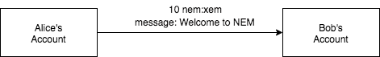
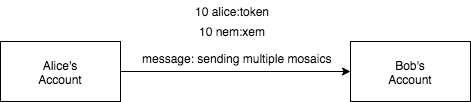

:orphan:

##############################
Sending a transfer transaction
##############################

Announce a :ref:`transfer transaction <transfer-transaction>`, one of the most commonly used actions in NEM.

#############
Prerequisites
#############

- Finish the :doc:`getting started section <../../getting-started/setup-workstation>`
- NEM2-SDK or CLI
- A text editor or IDE
- An account with XEM

**********
Background
**********

    Sending a transfer Transaction

Alice wants to send 10 XEM to Bob, who just created the following NEM account with address ``SD5DT3-CH4BLA-BL5HIM-EKP2TA-PUKF4N-Y3L5HR-IR54``.

**Monitoring the transaction**

Once an account announces a transaction, if properly formed, the server will return an OK response.

Receiving an OK response doesn't mean the transaction is valid, hence not included in a block. A good practice is to monitor transactions before being announced.

We suggest opening three new terminals. The first terminal :doc:`monitors announced transactions<../transaction/debugging-transactions>` validation errors.

.. code-block:: bash

    $> nem2-cli monitor status

Monitoring ``unconfirmed`` shows you which transactions have reached the network, but not yet included in a block.

.. code-block:: bash

    $> nem2-cli monitor unconfirmed

Once a transaction is included, you will see it under the ``confirmed`` terminal.

.. code-block:: bash

    $> nem2-cli monitor confirmed

************************
Let’s get into some code
************************

Alice sends ``10 XEM`` to Bob. She can also include a message, for example ``Welcome to NEM``.

.. example-code::

    .. literalinclude:: ../../resources/examples/typescript/transaction/SendingATransferTransaction.ts
        :language: typescript
        :lines:  26-34

    .. literalinclude:: ../../resources/examples/java/src/test/java/nem2/guides/examples/transaction/SendingATransferTransaction.java
        :language: java
        :lines:  45-53

    .. literalinclude:: ../../resources/examples/javascript/transaction/SendingATransferTransaction.js
        :language: javascript
        :lines:  31-39

Although the transaction is created, it has not been announced to the network yet.

To announce it, Alice shall sign the transaction with her account first so that the network can verify its authenticity.

.. example-code::

    .. literalinclude:: ../../resources/examples/typescript/transaction/SendingATransferTransaction.ts
        :language: typescript
        :lines:  38-44

    .. literalinclude:: ../../resources/examples/java/src/test/java/nem2/guides/examples/transaction/SendingATransferTransaction.java
        :language: java
        :lines:  55-60

    .. literalinclude:: ../../resources/examples/javascript/transaction/SendingATransferTransaction.js
        :language: javascript
        :lines:  43-48

Once signed, Alice can :doc:`announce the transaction <../../concepts/transaction>` to the network.

.. example-code::

    .. literalinclude:: ../../resources/examples/typescript/transaction/SendingATransferTransaction.ts
        :language: typescript
        :lines:  47-

    .. literalinclude:: ../../resources/examples/java/src/test/java/nem2/guides/examples/transaction/SendingATransferTransaction.java
        :language: java
        :lines:  63-66

    .. literalinclude:: ../../resources/examples/javascript/transaction/SendingATransferTransaction.js
        :language: javascript
        :lines:  52-

    .. literalinclude:: ../../resources/examples/cli/transaction/SendingATransferTransaction.sh
        :language: bash
        :start-after: #!/bin/sh

Open the terminal where you are monitoring account transactions ``status``, it should be empty. If you see an error, check :ref:`HTTP Error Codes <status-error>` and their meaning.

A new transaction should have appeared in the terminal where you are monitoring ``unconfirmed``. At this point, the transaction has reached the network, but it is not clear if it will get included in a block.

If it is included in a block, the transaction gets processed, and the amount stated in the transaction gets transferred from the sender's account to the recipient's account.

************
What's next?
************

Send a new transfer transactions by altering your code to send multiple mosaics in the same transaction.

**Adding multiple mosaics**

    Sending multiple mosaics in the same transaction

As you may have noticed, transfer transactions require an array of mosaics as a parameter, allowing to create transfer transactions with multiple mosaics at a time.

If you own more than one mosaic, try to send them together in the same transaction:

.. example-code::

    .. literalinclude:: ../../resources/examples/typescript/transaction/SendingATransferTransactionWithMultipleMosaics.ts
        :language: typescript
        :lines:  36-39

    .. literalinclude:: ../../resources/examples/java/src/test/java/nem2/guides/examples/transaction/SendingATransferTransactionWithMultipleMosaics.java
        :language: java
        :lines:  54-57

    .. literalinclude:: ../../resources/examples/javascript/transaction/SendingATransferTransactionWithMultipleMosaics.js
        :language: javascript
        :lines:  42-45

    .. literalinclude:: ../../resources/examples/cli/transaction/SendingATransferTransactionWithMultipleMosaics.sh
        :language: bash
        :start-after: #!/bin/sh