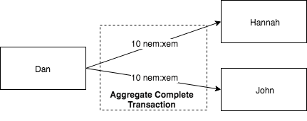

:orphan:

###################################################
Sending payouts with aggregate complete transaction
###################################################

Send transactions to different accounts atomically, using an :ref:`aggregate complete transaction <aggregate-transaction>`.

**********
Background
**********

It is Christmas, and uncle Dan wants to send money to their nephews Alice and Bob.

    Sending transactions to different recipients atomically

He chooses to send an aggregate complete transaction, so both of them will receive the funds at the same time.

*************
Prerequisites
*************

- Finish :doc:`sending a transfer transaction guide <sending-a-transfer-transaction>`
- NEM2-SDK
- A text editor or IDE
- An account with XEM

*************************
Let's get into some code
*************************

First, Dan creates two :ref:`transfer transaction <transfer-transaction>` with two different recipients, and wrap them in an :ref:`aggregate transaction <aggregate-transaction>`.

.. example-code::

    .. literalinclude:: ../../resources/examples/typescript/transaction/SendingPayoutsWithAggregateCompleteTransaction.ts
        :language: typescript
        :lines:  32-54

    .. literalinclude:: ../../resources/examples/java/src/test/java/nem2/guides/examples/transaction/SendingPayoutsWithAggregateCompleteTransaction.java
        :language: java
        :lines:  40-74

    .. literalinclude:: ../../resources/examples/javascript/transaction/SendingPayoutsWithAggregateCompleteTransaction.js
        :language: javascript
        :lines:  32-54

Do you know the difference between aggregate complete and aggregate bonded? In this case, one private key can sign all the transactions in the aggregate, so it is *aggregate complete*.

That means that there is no need to lock funds to send the transaction. If valid, it will be accepted by the network.

Just sign it and announce it!

.. example-code::

    .. literalinclude:: ../../resources/examples/typescript/transaction/SendingPayoutsWithAggregateCompleteTransaction.ts
        :language: typescript
        :lines:  57-

    .. literalinclude:: ../../resources/examples/java/src/test/java/nem2/guides/examples/transaction/SendingPayoutsWithAggregateCompleteTransaction.java
        :language: java
        :lines:  75-80

    .. literalinclude:: ../../resources/examples/javascript/transaction/SendingPayoutsWithAggregateCompleteTransaction.js
        :language: javascript
        :lines:  57-

************
What's next?
************

Try to send an aggregate bonded transaction by following :doc:`creating an escrow with aggregate bonded transaction <creating-an-escrow-with-aggregate-bonded-transaction>` guide.