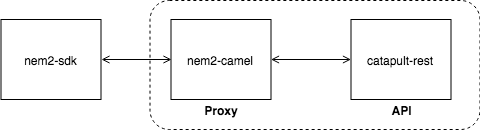

:orphan:

.. post:: 18 Aug, 2018
    :category: Monitoring
    :excerpt: 1
    :nocomments:

##################################################################
Turning the asynchronous transaction announcement into synchronous
##################################################################

Turn asynchronous transaction announcement into synchronous with |nem2-camel|.

**********
Background
**********

Alice is developing an app to send ``10 cat.currency`` to Bob. She wants to know if the transaction has reached the network before sending Bob an email.

When announcing a transaction in NIS1, you had to wait to get the response from the node. Catapult works differently. When a transaction is announced, the REST API server will always return an OK.

As a result, the developer does not have to wait until the server returns a response, being able to make more responsive apps.  However, it is the developer's responsibility to check the status of the transaction and ensure it is confirmed.

On the other hand, keeping track of transactions status adds unnecessary complexity to small projects. It also increases the difficulty when migrating from NIS1.

**nem2-camel** aims to solve these problems by providing a server that listens to the Catapult REST calls and acts as a proxy. When nem2-camel detects a transaction announcement, it waits for the confirmation via :ref:`WebSockets<websockets>` and returns the message to the HTTP call.

.. note:: The function ``TransactionHttp.announceSync()`` allows announcing transactions synchronously when using nem2-camel as a proxy.  nem2-camel will respond successfully when the transaction has reached the network and had no validation errors.  You might still need to :doc:`wait for several confirmations  <../../concepts/transaction>` before executing additional actions.

    nem2-camel

*************
Prerequisites
*************

- Finish :doc:`sending mosaics and messages between two accounts guide <sending-a-transfer-transaction>`
- Have one :ref:`account with cat.currency <setup-getting-a-test-account>`

**********************
Getting into some code
**********************

Running Catapult Service in local
=================================

For development and learning purposes, you can run the :doc:`Catapult Server and Catapult REST <../../concepts/node>` using the |catapult-service-bootstrap|.

1. Make sure you have |docker| and |docker-compose| installed before running the following instructions:

.. code-block:: bash

    git clone git@github.com:tech-bureau/catapult-service-bootstrap.git
    cd catapult-service-bootstrap
    ./cmds/start-all -d

2. If everything goes well, after the image has been downloaded and the service is running, check if you can get the first block information:

.. code-block:: bash

    curl localhost:3000/block/1

Getting Alice and Bob addresses
===============================

Once the Catapult Service is running, it will generate a set of :doc:`accounts <../../concepts/account>` containing cat.currency.

1. Find the key pairs which contain cat.currency under the section ``nemesis_addresses``.

.. code-block:: bash

    cd  build/generated-addresses/
    cat raw-addresses.yaml

2. Take the first key pair as Alice's account, and copy the private key.

3. Take the second key pair as Bob's account, and copy the address.

Installing nem2-camel
=====================

nem2-camel acts like a proxy between the application and the REST API.

.. note:: nem2-camel requires at least Java version 8.

1. Download the latest |nem2-camel-jar| package release, and run:

.. code-block:: bash

    java -jar nem2-camel.jar --url http://localhost:3000

2. After the service is up, use ``0.0.0.0:9000`` as the new proxy url.

Sending the TransferTransaction
================================

1. Alice creates a :doc:`TransferTransaction <../../concepts/transfer-transaction>`, sending ``10 cat.currency`` to Bob.

.. example-code::

    .. viewsource:: ../../resources/examples/typescript/transaction/TurningTheAsynchronousTransactionAnnouncementIntoSynchronous.ts
        :language: typescript
        :start-after:  /* start block 01 */
        :end-before: /* end block 01 */

2. Once signed, Alice :doc:`announces the transaction <../../concepts/transaction>`. Use ``TransactionHttp.announceSync`` instead of ``TransactionHttp.announce`` to wait until the transaction reaches the network, returning back the Transaction object.

.. example-code::

    .. viewsource:: ../../resources/examples/typescript/transaction/TurningTheAsynchronousTransactionAnnouncementIntoSynchronous.ts
        :language: typescript
        :start-after:  /* start block 02 */
        :end-before: /* end block 02 */

The transaction has an ``unconfirmed`` status. You might still need to :doc:`wait  for several confirmations <../../concepts/transaction>` before doing additional actions.

In case the Catapult REST server throws an error, the subscribe method will invoke the ``error function`` returning a ``TransactionStatus`` object.

.. |nem2-camel| raw:: html

   <a href="https://github.com/nemtech/nem2-camel" target="_blank">nem2-camel</a>

.. |nem2-camel-jar| raw:: html

   <a href="https://github.com/nemtech/nem2-camel/releases" target="_blank">nem2-camel jar</a>

.. |docker| raw:: html

    <a href="https://docs.docker.com/install/" target="_blank">docker</a>

.. |docker-compose| raw:: html

    <a href="https://docs.docker.com/compose/install/" target="_blank">docker compose</a>

.. |catapult-service-bootstrap| raw:: html

   <a href="https://github.com/tech-bureau/catapult-service-bootstrap/" target="_blank">Catapult Service Bootstrap</a>
