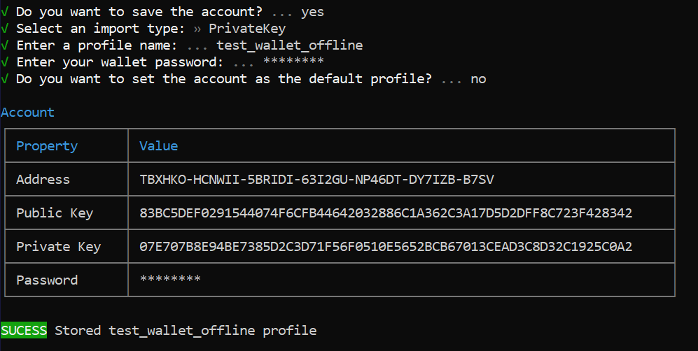

:orphan:

.. post:: 8 Jun, 2020
    :category: Transfer Transaction
    :tags: SDK, CLI
    :excerpt: 1
    :nocomments:

#############################
Signing a transaction offline
#############################

This guide will show you how to sign a transaction offline then use an online computer to announce the transaction.

This can be useful for when you are keeping your private keys in an offline device (cold wallet) for security reasons. By signing a transaction offline, you will be able to execute transactions from your cold wallet while keeping your private keys completely safe.

The example in the guide will send 155 |networkcurrency| from your offline wallet to Bob (``TCHS3AOXFGWGTN2QUUHDCXJ4SBYLIQIPNUPHHA2N``)

*************
Prerequisites
*************

- Create a new :ref:`account <setup-creating-a-test-account>`.
- Load the account with enough |networkcurrency| to pay for transaction fees.
- Both your offline and online :doc:`workstations <../../getting-started/setup-workstation.rst>` are set up for Symbol-CLI and Symbol-SDK.
- You installed the `Symbol URI scheme <https://github.com/nemfoundation/symbol-uri-scheme>`_.

*********************************
Step 1: Create an offline account
*********************************

.. note:: This step is only necessary if you don't already have an offline account.

On your offline workstation, open up your terminal and type:

.. code-block:: bash

    `symbol-cli account generate --network TEST_NET --generation-hash 4009619EB7A9F824C5D0EE0E164E0F99CCD7906A475D7768FD60B452204BD0A2 --namespace-id symbol.xym --divisibility 6 --url http://api-01-ap-northeast-1`

But replace the "generation hash" and node "url" to match the information on your CLI.

.. note:: To figure out the node information, pass `symbol-cli node info`

Select to save the account, by either the Private Key or Mnemonic Phrase. Enter the desired wallet profile name and password.
If successful, the CLI should return the information of the created account.

.. note:: Remember to transfer some XYM tokens into this account before you continue with the guide.

***************************************************
Step 2: Set up a transaction through the symbol-cli
***************************************************

On your offline workstation, open up your terminal and type:

.. code-block:: bash

    `symbol-cli transaction transfer`

Enter your wallet password and the details of your transfer transaction.

Once you have entered this information, the CLI will return the transaction information and ask you if you wish to announce the transaction. Type ``n`` for "no".

Here, you have already successfully signed the transaction offline. Save the signed transaction payload provided by the CLI.

*****************************************************
Step 3: Set up to convert the transaction into an URI
*****************************************************

Open a text editor and set up the following typescript file to generate a URI:

.. example-code::

    .. viewsource:: ../../resources/examples/typescript/transfer/SigningATransactionOffline.ts
        :language: typescript
        :start-after:  /* start block 01 */
        :end-before: /* end block 01 */

Make sure you replace the transaction payload provided in the example with your own from step 1.

Save the typescript file.

***********************************
Step 4: Obtain your transaction URI
***********************************

Run the file from step 2 in your terminal.

.. code-block:: bash

    `tsc transaction-uri.ts`
    `node transaction-uri.js`

When executed successfully, your terminal should return the URI of your transaction.

.. code-block:: bash

    `web+symbol://transaction?data=BC00000000000000E103B81AF5C9B507AEA2D9F72A5F34C24174C57A36C6E118D520FF2B12E681C3C7B90E7EB37F06CE313466EF96A850E7845ECBF84FCD48D0DEB22A618FE7750BC0D6111B2AC378C69A4C71D013D3C4A748BE4EE48635EB79FC3B4696157BF6320000000001985441A0860100000000007044243C04000000988F2D81D729AC69B750A50E315D3C9070B4410F6D1E73834D010C0000000000EEAFF441BA994BE7C0D454070000000000496D2074686520626F7373&generationHash=test&nodeUrl=http://localhost:3000&webhookUrl=http://myapp.local/id`

Save the URI of your transaction.

**********************************************
Step 5: Announce the transaction using the URI
**********************************************

Move to your online workstation.

Navigate to announce the transaction in the Symbol-CLI.

.. code-block:: bash

    `symbol-cli transaction uri`

After you enter your wallet password, enter the transaction URI obtained from step 3.

Announce the transaction by typing ``Y`` for "Yes".

If successful, the terminal should return: ``SUCCESS Transaction announced correctly.``

