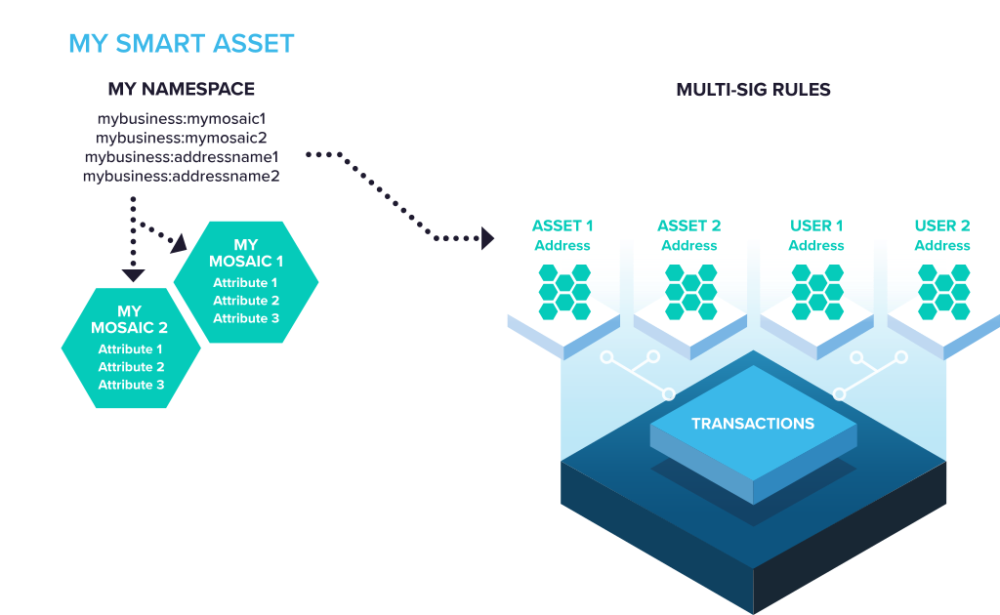

###########################
NEM Developer Documentation
###########################

|nem| is a blockchain platform built from the ground up to be simple for developers to use blockchain technology.

NEM is built around a powerful system for customizing your use of the blockchain. We call it the “Smart Asset System”, and it gives you the power to use NEM as if it were a custom blockchain built for your application and your assets.

    The Smart Asset System

Rather than force you to write your own “smart contract” code from scratch or use off-blockchain methods of defining custom assets for your application, NEM gives you direct access to a specialized set of tested and secure on-blockchain features.

NEM is suitable for an amazing variety of solution classes, such as direct public transactions via a streamlined smartphone app, efficient cloud services that connect client or web applications, or a high-performance permissioned enterprise back-end for business-critical record keeping.

.. note:: This documentation refers to NEM latest version, **Catapult**, which provides higher performance and new functionalities to NEM.

Here you will find everything you need to implement NEM in your application or service.

Getting started
===============
Is this your first time developing with blockchain technology? NEM was created to be your entry point into the blockchain industry.

Start by :doc:`setting up your working environment <getting-started/setup-workstation>` and then :doc:`follow the first guide <getting-started/first-application>`.

Fundamentals
============
NEM Smart Assets are built using four closely connected parts: :doc:`Accounts <concepts/account>`,  :doc:`Transactions <concepts/transaction>`,  :doc:`Namespaces <concepts/namespace>` and :doc:`Mosaics <concepts/mosaic>`.

Developer Guides
================
Easy-to-follow :doc:`step by step guides <guides/overview>` with code examples.

References
==========
NEM provides tools and services to accelerate blockchain development, greatly reducing development time.

* Interact with NIS2-API directly from bash with :doc:`NEM2-CLI <cli/overview>`.
* See how :doc:`NEM2-SDK <sdk/overview>` makes API interaction much easier in different programming languages.
* Understand how :doc:`NIS2-API <api/overview>` routes and its behaviour.
* Check and discover :doc:`NEM2 Libraries <libraries/overview>` which extend NEM capabilities.

Support
=======
Couldn't find what you were looking for? Visit :doc:`Support <support/contributing>`.

Continue: :doc:`Getting started <getting-started/setup-workstation>`.

.. |nem| raw:: html

    <a href="https://nem.io/" target="_blank">NEM</a>

.. toctree::
    :maxdepth: 2
    :hidden:
    :caption: Getting Started

    getting-started/setup-workstation
    getting-started/first-application

.. toctree::
    :maxdepth: 2
    :hidden:
    :caption: Fundamentals

    concepts/account
    concepts/multisig-account
    concepts/transaction
    concepts/namespace
    concepts/mosaic
    concepts/block
    concepts/node

.. toctree::
    :maxdepth: 2
    :hidden:
    :caption: Guides
    
    guides/overview
    guides/account
    guides/blockchain
    guides/namespace
    guides/mosaic
    guides/transaction

.. toctree::
    :maxdepth: 2
    :hidden:
    :caption: NEM2-CLI

    cli/overview
    cli/commands

.. toctree::
    :maxdepth: 2
    :hidden:
    :caption: NEM2-SDK

    sdk/overview
    sdk/architecture
    sdk/languages

.. toctree::
    :maxdepth: 2
    :hidden:
    :caption: NIS2-API

    api/overview
    api/announce-transaction
    api/websockets
    api/errors

.. toctree::
    :maxdepth: 2
    :hidden:
    :caption: NEM2 Libraries

    libraries/overview

.. toctree::
    :maxdepth: 2
    :hidden:
    :caption: Support
    
    support/contributing