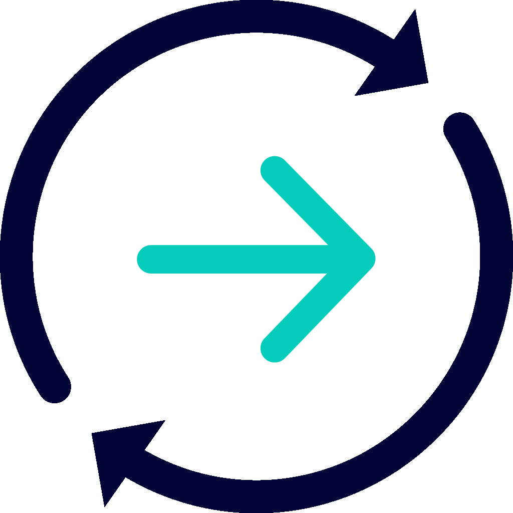

.. raw:: html

    

        <h1>NEM Developer Center</h1>
        
Start integrating NEM into your application.

        

.. raw:: html

        

    

    <section class="container">
        

            
NEM is a blockchain platform built from the ground up to be <b>simple for developers to use</b>. NEM  gives you direct access to a specialized set of <b>tested</b> and secure <b>on-blockchain features</b> using your favourite <a href="sdk/overview.html"><b>programming language</b></a>.

            
 This documentation refers to NEM latest version, <b>Catapult</b>, which provides higher performance and new functionalities to NEM.

        

    </section>
.. raw:: html

    <section class="home container card-container gap">
        

            

                 <a href="getting-started/what-is-nem.html">

                    

.. raw:: html

                    

                    

                        <h3>Getting started</h3>
                        
Learn about NEM by developing your first blockchain app.

                       <b>START</b>
                   

                
</a>
            

            

                 <a href="concepts/account.html">

                    

.. raw:: html

                    

                    

                        <h3>Built-in Features</h3>
                        
Discover in-depth the connected parts that make up the Smart Asset System.

                       <b>DISCOVER</b>
                   

                
</a>
            

        

        

            

                 <a href="guides/overview.html">

                    

.. raw:: html

                    

                    

                    <h3>Guides</h3>
                    
Easy-to-follow step by step guides with code examples.

                   <b>CREATE</b>
                   

                
</a>
            

       

                 <a href="references.html">

                    

.. raw:: html

                    

                    

                    <h3>References</h3>
                    
From SDKs to extensions that make blockchain development easier.

                   <b>LEARN MORE</b>
                   

                
</a>
            

        

    </section>

********************
NEM Developer Center
********************

.. toctree::
    :maxdepth: 2
    :hidden:
    :caption: Getting Started

    getting-started/what-is-nem
    getting-started/setup-workstation
    getting-started/first-application

.. toctree::
    :maxdepth: 2
    :hidden:
    :caption: Protocol

    concepts/cryptography
    concepts/block
    concepts/transaction
    concepts/node

.. toctree::
    :maxdepth: 2
    :hidden:
    :caption: Built-in Features

    concepts/account
    concepts/multisig-account
    concepts/multi-level-multisig-account
    concepts/namespace
    concepts/mosaic
    concepts/transfer-transaction
    concepts/aggregate-transaction
    concepts/cross-chain-swaps

.. toctree::
    :maxdepth: 2
    :hidden:
    :caption: Guides

    guides/overview
    guides/account
    guides/blockchain
    guides/namespace
    guides/mosaic
    guides/transaction
    guides/running-a-node
    guides/workshops

.. toctree::
    :maxdepth: 2
    :hidden:
    :caption: REST API

    api/requests
    api/tools
    api/endpoints
    api/websockets
    api/status-errors

.. toctree::
    :maxdepth: 2
    :hidden:
    :caption: SDKs

    sdk/overview
    sdk/architecture
    sdk/languages
    sdk/libraries

.. toctree::
    :maxdepth: 2
    :hidden:
    :caption: Client

    cli/overview
    cli/commands
    

.. toctree::
    :maxdepth: 2
    :hidden:
    :caption: Prototyping Tool

    prototyping-tool/overview
    prototyping-tool/configuring-nodes
    prototyping-tool/examples

.. toctree::
    :maxdepth: 2
    :hidden:
    :caption: Support

    support/community
    support/contributing
    support/contributors
