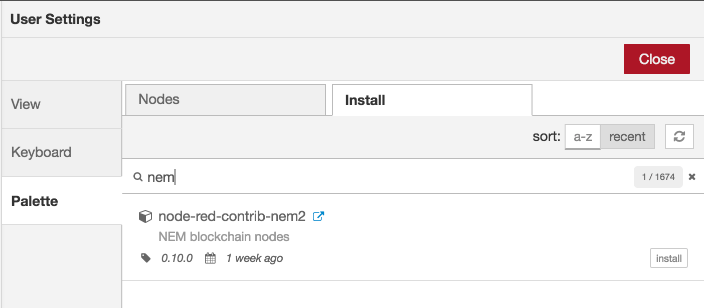

################
Prototyping Tool
################

.. note:: ⚠️ The prototyping tool is not compatible with the latest version of catapult-server (0.3).

.. figure:: https://gist.githubusercontent.com/jorisadri/7061090eb3cbf724c80e4f49e03e1b94/raw/69b1b9f80594feb9a415aac8de62c769295c397b/transferTransaction.png
    :align: center

Create blockchain applications without coding using **NEM2 Prototyping Tool**.

Drag & drop NEM nodes and link them with other services in new and interesting ways for prototyping or learning purposes.

|NEM2-Prototyping-Tool| is a collection of **Node-RED** nodes.

|Node-RED| is a visual programming tool to wire together hardware devices, APIs and online services.

It provides a browser-based editor to wire nodes. The combination of nodes is named flows, which you can execute in a single click.

The flows created in Node-RED are stored using JSON, being exportable to share with others.

************
Installation
************

Download and run the |executable-package| for **Windows**, **Linux** or **Mac**.

Do you already have Node-RED app? Open ``Manage palette`` and install |nem2-node-red| package.

    *Manage palette -> Install -> node-red-contrib-nem2*

.. |Node-RED| raw:: html

    <a href="https://nodered.org/" target="_blank">Node-RED</a>

.. |NEM2-Prototyping-Tool| raw:: html

    <a href="https://github.com/nemtech/nem2-prototyping-tool" target="_blank">NEM2 Prototyping Tool</a>

.. |nem2-node-red| raw:: html

    <a href="https://flows.nodered.org/node/node-red-contrib-nem2" target="_blank">node-red-contrib-nem2</a>

.. |executable-package| raw:: html

    <a href="https://github.com/nemtech/nem2-prototyping-tool/releases/tag/v0.10.0" target="_blank">executable package</a>

.. |installation| raw:: html

    <a href="https://github.com/nemtech/nem2-prototyping-tool/tree/v0.10.0#installation" target="_blank">installation</a>

*****************
Configuring nodes
*****************

The left sidebar is the **node palette**. You can find NEM related nodes under:

* NEM2 Account
* NEM2 Transactions
* NEM2 Listeners
* NEM2 Utility

1. Open the *NEM account* tab and click once on the **account** node.

The right sidebar shows you the node description, properties, input fields and returned outputs.

You have to link nodes together, connecting the previous node outputs with the following node inputs.

In some cases, you could configure inputs and properties directly by double-clicking a node.

.. figure:: resources/images/screenshots/nem2-prototyping-tool-node-palette.png
    :align: center

    The node palette and node help sidebars.

2. Let's link account with other nodes. As we need a ``privateKey`` as an input, we could opt to drag and drop and link **generateAccount** with **account** node, under *NEM Account*.

.. figure:: resources/images/screenshots/nem2-prototyping-tool-link-nodes.png
    :align: center
    :width: 500px

    Drag and drop and link nodes together.

3. Double-click on account node. Choose the ``network`` you want to use. Do the same for generateAccount node.

.. figure:: resources/images/screenshots/nem2-prototyping-tool-edit-account-node.png
    :align: center
    :width: 500px

    Complete node properties.

.. note:: Have you seen  ``private key`` under account node properties?  Setting a property hardcoded overwrites the input. In other words, when not empty, this property will be used instead of ``privateKey`` output provided by generateAccount node.

4. Finally, find **debug** node in the node palette, under *output* tab. Link it with the account, and inside its properties change  ``output``  to ``complete msg object``.

Configuring an API gateway
==========================

Some nodes require to configure an API gateway (e.g. **announce transaction** and **listener** nodes).

1. Double-click on a node which needs this configuration.

2. Click on the pencil icon next to the ``Server`` input field.

3. Enter your ``custom url`` using http or https schema (e.g. http://localhost). Choose the ``network`` and ``port`` you want to use and then press ``Update``.

.. figure:: resources/images/screenshots/nem2-prototyping-tool-edit-server-config-node.png
    :align: center
    :width: 500px

Running a flow
==============

1. Click on the ``deploy`` button, at the top-right corner of your screen. Select the square attached to the first node to run the flow.

2. Check the output returned at the right sidebar, under the debug tab. NEM2 nodes return outputs following the structure ``msg.nem.<name_of_the_output>``.

.. figure:: resources/images/screenshots/nem2-prototyping-tool-debug.png
    :align: center
    :width: 500px

    See outputs under debug tab.

.. |installation-instructions| raw:: html

    <a href="https://github.com/nemtech/nem2-prototyping-tool" target="_blank">installation instructions</a>

.. |download-the-app| raw:: html

    <a href="https://github.com/nemtech/nem2-prototyping-tool/releases" target="_blank">Download the app</a>

Importing a flow
================

After opening an example, copy the JSON you will find at the bottom of the site.

In Node-RED, select ``Import > Clipboard from the menu`` (Ctrl-E). Paste the JSON flow and click Import button.

********
Examples
********

Basics
======

* `Create a transfer transaction <https://flows.nodered.org/flow/7061090eb3cbf724c80e4f49e03e1b94>`_
* `Create namespace <https://flows.nodered.org/flow/3d87669bfc71e99f29f5ad82ba2a402e>`_
* `Create mosaic <https://flows.nodered.org/flow/04a643b66a8e0daa1e12fa61e3b36b7c>`_
* `Create multisig account <https://flows.nodered.org/flow/ba75b67684b2a1bc2af849cc70a7c4b5>`_
* `Create aggregate transaction <https://flows.nodered.org/flow/50aa98fd20e62ee1af8507df8634f840>`_
* `Cosign aggregate transaction <https://flows.nodered.org/flow/522d512fb0b5e0ad16a65a8c909fd95a>`_

Applications
============

* `Simple chat <https://flows.nodered.org/flow/e8bfbab9d73e0f35ed6b4c9a9f7e4958>`_

We love to receiving contributions from our community — you! Follow these guidelines to get your flow included in this documentation.

The first step is to export the flow you have created. In Node-RED, select the flow you want to export. Open ``Export > Clipboard`` from the menu (Ctrl-E) and copy the JSON from the dialogue.

We are using |Node-RED-flows-repository| to share our flows.

1. Click ``Add flow``.
2. Give your flow a short, descriptive title and describe what the flow does and how it is used.
3. Paste the JSON flow you want to share.
4. Add the tag ``NEM2``.

After a while, your flow and your GitHub username will be included in this page.

.. |Node-RED-flows-repository| raw:: html

    <a href="https://flows.nodered.org/?term=nem2&type=flow&num_pages=1" target="_blank">Node RED flows repository</a>

