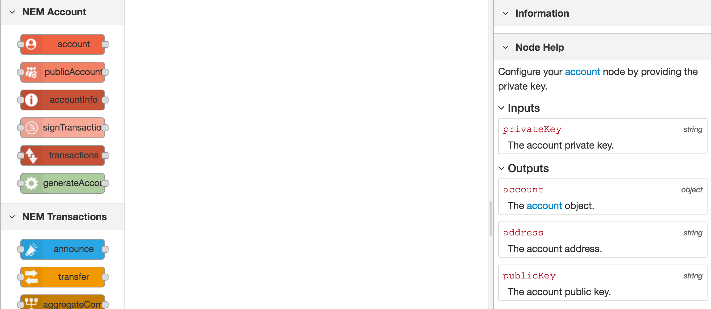
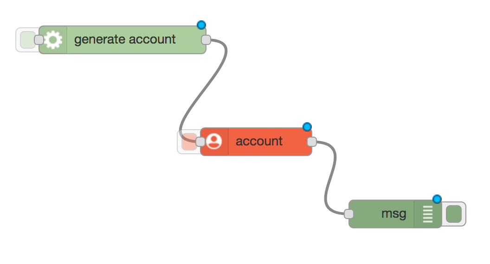
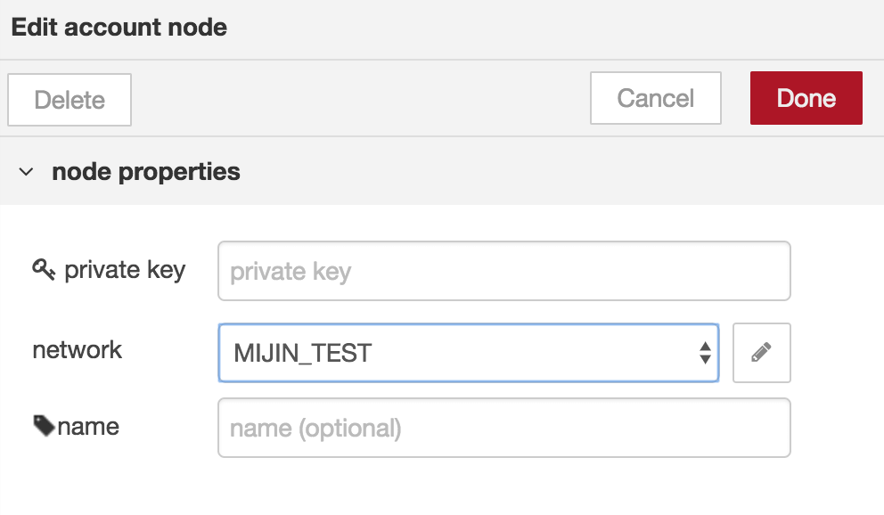
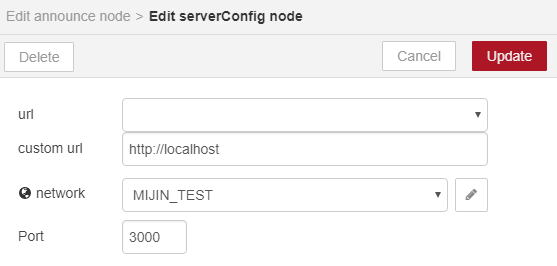
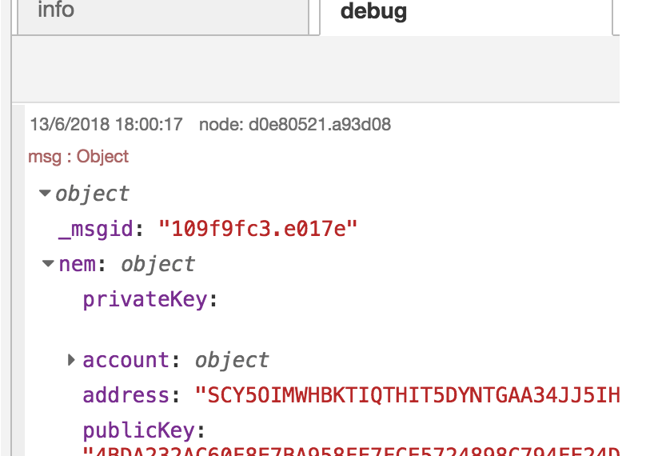

#################
Configuring Nodes
#################

The left sidebar is the **node palette**. You can find NEM related nodes under:

* NEM2 Account
* NEM2 Transactions
* NEM2 Listeners
* NEM2 Utility

1. Open the *NEM account* tab and click once on the **account** node.

The right sidebar shows you the node description, properties, input fields and returned outputs.

You have to link nodes together, connecting the previous node outputs with the following node inputs.

In some cases, you could configure inputs and properties directly by double-clicking a node.

    The node palette and node help sidebars.

2. Let's link account with other nodes. As we need a ``privateKey`` as an input, we could opt to drag and drop and link **generateAccount** with **account** node, under *NEM Account*.

    Drag and drop and link nodes together.

3. Double-click on account node. Choose the ``network`` you want to use. Do the same for generateAccount node.

    Complete node properties.

.. note:: Have you seen  ``private key`` under account node properties?  Setting a property hardcoded overwrites the input. In other words, when not empty, this property will be used instead of ``privateKey`` output provided by generateAccount node.

4. Finally, find **debug** node in the node palette, under *output* tab. Link it with the account, and inside its properties change  ``output``  to ``complete msg object``.

***********************
Configuring API gateway
***********************

Some nodes require to configure an API gateway (e.g. **announce transaction** and **listener** nodes).

1. Double-click on a node which needs this configuration.

2. Click on the pencil icon next to the ``Server`` input field.

3. Enter your ``custom url`` using http or https schema (e.g. http://localhost). Choose the ``network`` and ``port`` you want to use and then press ``Update``.

    
**************
Running a flow
**************

1. Click on the ``deploy`` button, at the top-right corner of your screen. Select the square attached to the first node to run the flow.

2. Check the output returned at the right sidebar, under the debug tab. NEM2 nodes return outputs following the structure ``msg.nem.<name_of_the_output>``.

    See outputs under debug tab.

.. |Node-RED| raw:: html

    <a href="https://nodered.org/" target="_blank">Node-RED</a>

.. |installation-instructions| raw:: html

    <a href="https://github.com/nemtech/nem2-prototyping-tool" target="_blank">installation instructions</a>

.. |download-the-app| raw:: html

    <a href="https://github.com/nemtech/nem2-prototyping-tool/releases" target="_blank">Download the app</a>
