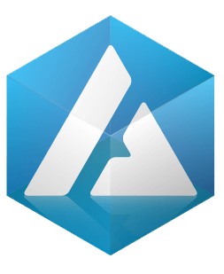

:orphan:

.. raw:: html

        <link rel="stylesheet" href="https://cdn.rawgit.com/konpa/devicon/df6431e323547add1b4cf45992913f15286456d3/devicon.min.css">
        

                <h1>Reference Documentation</h1>
                

                        
From SDKs in your favorite languages to extensions that make blockchain development easier.

                

        

        

                <section class="gap">
                        

                                

                                        

                                                <h2>Clients & Apps</h2>
                                                
Apps to interact with the NEM blockchain.

                                        

                                

                                

                                        

                                                

                                                       <a href="cli/overview.html">
                                                        

                                                            <i class="fas fa-terminal colored blue"></i>
                                                            <h4>Client</h4>
                                                        
</a>
                                                

                                                

                                                        <a href="prototyping-tool/overview.html">
                                                        

                                                            <i class="fas fa-bezier-curve colored blue"></i>
                                                            <h4>Prototyping</h4>
                                                        
</a>
                                                

                                        

                                

                        

                </section>

                <section class="inner-gap bg-gray">
                        

                                

                                        

                                             <h2>NEM2-SDK</h2>
                                              
The <a href="sdk/overview.html"><b>NEM2 Software Development Kit</b></a> is the primary software development tool to create NEM2 components, such as additional tools, libraries or applications.

                                        

                                

                                

                                        

                                                

                                                        <a href="https://nemtech.github.io/nem2-sdk-typescript-javascript/">
                                                        

                                                            <i class="devicon-typescript-plain colored"></i>
                                                            <h4>Typescript</h4>
                                                        
</a>
                                                

                                                

                                                       <a href="https://nemtech.github.io/nem2-sdk-typescript-javascript/">
                                                        

                                                            <i class="devicon-javascript-plain colored"></i>
                                                            <h4>Javascript</h4>
                                                        
</a>
                                                

                                                

                                                        <a href="https://nemtech.github.io/nem2-sdk-java/">
                                                        

                                                          <i class="devicon-java-plain colored"></i>
                                                            <h4>Java</h4>
                                                        
</a>
                                                

                                                

                                                        <a href="https://github.com/nemtech/nem2-sdk-csharp">
                                                        

                                                            <i class="devicon-csharp-plain colored"></i>
                                                            <h4>C#</h4>
                                                        
</a>
                                                

                                                

                                                        <a href="https://github.com/proximax-storage/nem2-sdk-go/">
                                                        

                                                            <i class="devicon-go-plain colored"></i>
                                                            <h4>Go</h4>
                                                        
</a>
                                                

                                                

                                                        <a href="https://github.com/proximax-storage/nem2-sdk-swift/">
                                                        

                                                            <i class="devicon-swift-plain colored"></i>
                                                            <h4>Swift</h4>
                                                        
</a>
                                                

                                                

                                                        <a href="sdk/languages.html">
                                                        

                                                            <i class="devicon-php-plain"></i>
                                                            <h4>PHP</h4>
                                                        
</a>
                                                

                                                

                                                        <a href="sdk/languages.html">
                                                        

                                                            <i class="devicon-cplusplus-plain"></i>
                                                            <h4>C++</h4>
                                                        
</a>
                                                

                                                

                                                        <a href="sdk/languages.html">
                                                        

                                                            <i class="devicon-python-plain"></i>
                                                            <h4>Python</h4>
                                                        
</a>
                                                

                                                

                                                        <a href="sdk/languages.html">
                                                        

                                                            <i class="devicon-ruby-plain"></i>
                                                            <h4>Ruby</h4>
                                                        
</a>
                                                

                                        

                                

                        

                </section>

                <section class="inner-gap">
                            

                                

                                        

                                                <h2>Extensions</h2>
                                                
Collection of <a href="sdk/libraries.html"><b>libraries</b></a> and tools to accelerate blockchain development.

                                        

                                

                                

                                        

                                                

                                                        <a href="https://github.com/tech-bureau/catapult-service-bootstrap">
                                                        

                                                              <i class="devicon-docker-plain colored"></i>
                                                            <h4>Catapult Service</h4>
                                                        
</a>
                                                

                                                

                                                       <a href="https://github.com/nemtech/nem2-camel">
                                                        

                                                            <i class="fas fa-sync colored blue"></i>
                                                            <h4>NEM2 Camel</h4>
                                                        
</a>
                                                

                                                

                                                        <a href="https://apostille.io/">
                                                        
<i>

.. raw:: html

                                                        </i>
                                                        <h4>Apostille</h4>
                                                         
</a>
                                                

                                                

                                                        <a href="https://github.com/aleixmorgadas/nem2-nonfungible-asset">
                                                        

                                                              <i class="fas fa-box colored blue"></i>
                                                            <h4>Non-fungible asset</h4>
                                                        
</a>
                                                

                                        

                                

                        

                </section>

                <section class="bg-gray inner-gap subtitle-container">
                        

                                

                                        

                                             <h2>Catapult REST API</h2>
                                              
<a href="api/requests.html"><b>Catapult REST API</b></a> combines HTTP and WebSockets to perform read and write actions in the NEM blockchain.

                                        

                                

                                

                                        

                                                

                                                        <a href="api/requests.html">
                                                        

                                                          <i class="fas fa-sliders-h colored green"></i>
                                                          <h4>Requests</h4>
                                                        
</a>
                                                

                                                

                                                        <a href="api/tools.html">
                                                              

                                                                <i class="fas fa-toolbox colored green"></i>
                                                                  <h4>Tools</h4>
                                                              

                                                      </a>
                                                

                                                

                                                        <a href="api/endpoints.html">
                                                                

                                                                  <i class="fas fa-exchange-alt colored green"></i>
                                                                  <h4>Endpoints</h4>
                                                                

                                                        </a>
                                                

                                                

                                                        <a href="api/websockets.html">
                                                              

                                                                  <i class="fas fa-dot-circle colored green"></i>
                                                                  <h4>Websockets</h4>
                                                              

                                                        </a>
                                                

                                                

                                                        <a href="api/status-errors.html">
                                                              

                                                                  <i class="fas fa-times colored green"></i>
                                                                  <h4>Status Errors</h4>
                                                              

                                                        </a>
                                                

                                        

                                

                        

                </section>
        

*********
Reference
*********

