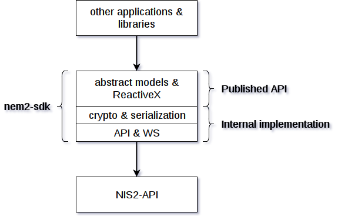

############
Architecture
############

***************
Characteristics
***************

- **Standardized Contracts**: Guaranteeing interoperability and harmonization of data models.
- **Loose Coupling**: Reducing the degree of component coupling fosters.
- **Abstraction**: Increasing long-term consistency of interoperability and allowing underlying components to evolve independently.
- **Reusability**: Enabling high-level interoperability between modules and potential component consumers.
- **Stateless**: Increasing availability and scalability of components allowing them to interoperate more frequently and reliably.
- **Composability**: For components to be effectively composable they must be interoperable.

********
Reactive
********

Reactive Programming
    In computing, **reactive programming** is a declarative programming paradigm concerned with data streams and the propagation of change. This means that it becomes possible to express static (e.g. arrays) or dynamic (e.g. event emitters) *data streams* with ease via the employed programming language(s), and that an inferred dependency within the associated execution model exists, which facilitates the *automatic propagation of the change involved with data flow*. 
    |rp-wiki|.

Observer Pattern
    The **observer pattern** is a software design pattern in which an object, called the *subject*, maintains a list of its dependents, called *observers*, and notifies them automatically of any state changes, usually by calling one of their methods.
    |op-wiki|.

.. note: If you are not familiar with Reactive Programming,  .

NEM2-SDK uses intensely ReactiveX Library. See |reactivex|.

- **Functional**: Developers can avoid complex stateful programs using clean input/output functions over observable streams.
- **Less is more**: ReactiveX's operators often reduce what was once an elaborate challenge into a few lines of code.
- **Async error handling**: Traditional try/catch is powerless for errors handling in asynchronous computations, but ReactiveX will offer developers the proper tools to handle these sort of errors.
- **Concurrency**: Observables and Schedulers in ReactiveX allow the programmer to abstract away low-level threading, synchronization, and concurrency issues.
- **Frontend**: Manipulation of UI events and API responses on the Web using RxJS.
- **Backend**: Embrace ReactiveX's asynchronicity, enabling concurrency and implementation independence.

.. note:: In case you are not familiar with ReactiveX and you still have to deliver something fast, you can convert an observable to Promise/Future by reviewing this |rp-promise-example|. However, **we encourage you to learn ReactiveX**.

References
==========

- |rxjsinaction|
- |frp|
- |learnrxjs|

********************
Package Organization
********************

    Package organization diagram

Infrastructure
==============

The HTTP requests are made following the Repository Pattern, and they return NEM Domain immutable models via the Observable Pattern.

Models
======

The NEM Domain models are, usually, immutable by definition. The developer cannot change its attributes. Instead, the developers have to create new Transactions and dispatch them to NEM Blockchain via TransactionHTTP, to change the NEM Blockchain state.

Services
========

Common operations that require multiple :doc:`REST API<../api>` requests are handled by already provided services.

.. |reactivex| raw:: html

    <a href="http://reactivex.io/" target="_black">reactivex here</a>

.. |rxjsinaction| raw:: html

    <a href="https://www.manning.com/books/rxjs-in-action" target="_black">RxJS in Action</a>

.. |frp| raw:: html

    <a href="https://www.manning.com/books/functional-reactive-programming" target="_black">Functional Reactive Programming</a>

.. |rp-wiki| raw:: html

    <a href="https://en.wikipedia.org/wiki/Reactive_programming" target="_black">Wikipedia reference</a>

.. |op-wiki| raw:: html

    <a href="https://en.wikipedia.org/wiki/Observer_pattern" target="_black">Wikipedia reference</a>

.. |learnrxjs| raw:: html

    <a href="https://www.learnrxjs.io/" target="_black">Learn RxJS</a>

.. |rp-promise-example| raw:: html

    <a href="https://www.learnrxjs.io/operators/utility/topromise.html" target="_black">example</a>

Continue: :doc:`Languages <languages>`.
