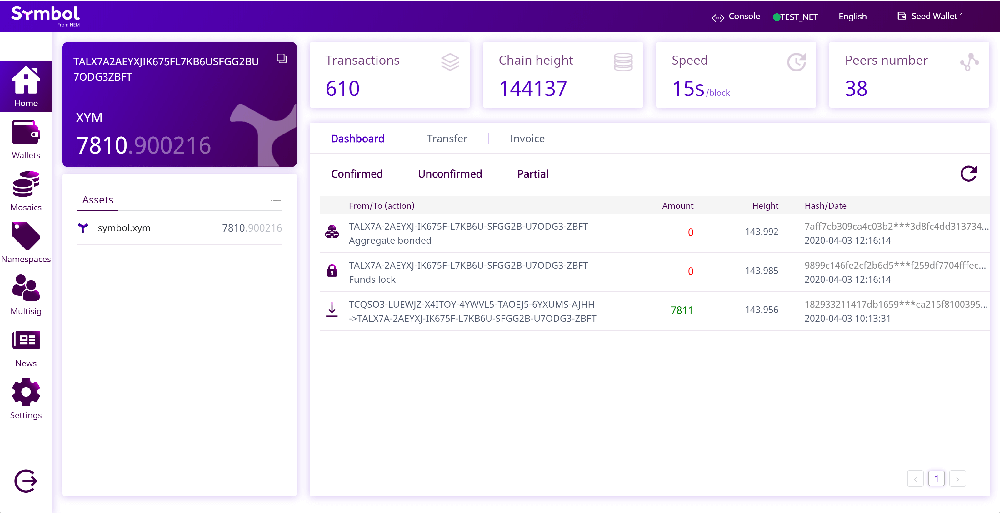

#######
Wallets
#######

.. _wallet-desktop:

**************
Desktop Wallet
**************

Cross-platform client for Symbol to manage accounts, mosaics, namespaces, and issue transactions.
|desktop-wallet| is available for Mac, Windows, and as a web application.

.. note:: The desktop wallet is only available for the public test network.

Installation
============

1. Download the |desktop-wallet| from the `releases section <https://github.com/nemgrouplimited/symbol-desktop-wallet/releases>`_.
The executable file for your operative system is under the "Assets" tab.

2. Launch the executable file and follow the installation instructions.

3. Follow this :doc:`step-by-step guide <guides/account/creating-an-account>` to create a new account.

Guides
======

.. postlist::
    :tags: wallet
    :date: %A, %B %d, %Y
    :format: {title}
    :list-style: circle
    :excerpts:
    :sort:
